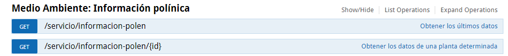
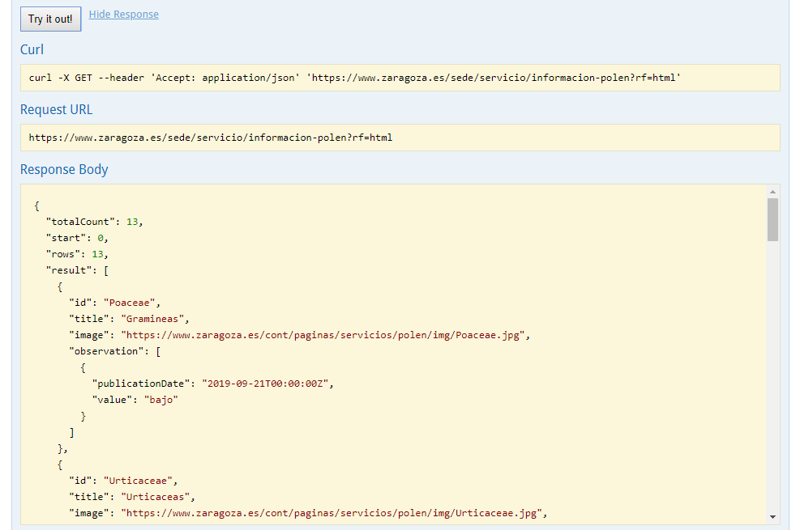
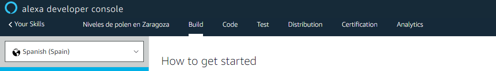
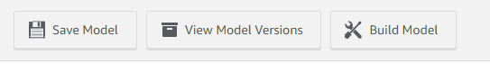
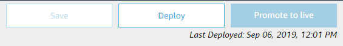
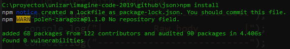
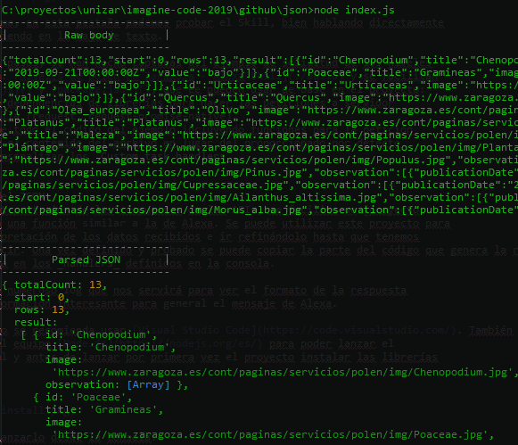

# Imagine Code 2019
## Starter challenge

El objetivo de este reto es crear una Skill de Alexa que obtenga los datos de los servicios 
facilitados por el Ayuntamiento de Zaragoza en portal de Datos Abiertos.

A continuación se detalla un ejemplo de creación de un Skill que proporciona información 
sobre los niveles de polen en la ciudad de Zaragoza. 

### Planificación de la Skill
En primer lugar debemos decidir qué datos queremos facilitar con nuestra Skill. El Ayuntamiento 
de Zaragoza posee un ámplio abanico de servicios de Datos Abierto que proporcionan información 
de todo tipo.

Estos servicios cumplen con el estandard OpenAPI y están integrados dentro de una 
[interfaz Swagger](https://www.zaragoza.es/docs-api_sede/#/) que nos permite hacer consultas de forma sencilla y ver los datos que 
debemos informar en las peticiones y las respuestas que obtenemos.

En nuestro ejemplo, usaremos los servicios de Medio Ambiente sobre información polínica:

Hacemos la petición por defecto y obtenemos un JSON con los datos:

Viendo los datos, pensamos que podría ser interesante tener:
* Un informe general de los niveles.
* Poder especificar un nivel.
  
así que la próxima tareas son:
1. Definir el skill en Alexa.
2. Realizar el _parseo_ de los datos para poder integrarlos dentro de Alexa.

### Definir el Skill en Alexa
Desde la [Consola de Desarrollador de Alexa](https://developer.amazon.com/alexa/console/ask) creamos una 
cuenta gratuita y definimos la nueva Skill:
* Idioma por defecto: Español.
* Modelo: Custom.
* Recursos backend: Alexa-Hosted (Node.js)
  
con esto tendremos la base de nuestra skill, alojada en los servidores de Amazon de 
forma gratuita y accesible desde la aplicación Alexa en el móvil y se utiliza la misma 
cuenta de Amazon utilizada en la consola de desarrolladores.

Para el desarrollo de la Skill seguiremos tres pasos del nivel superior: **Build**, **Code**, 
**Test**.

* **Build:** Solo utilizaremos la parte superior con el *Interaction Model*. Nos permite 
  definir las acciones de nuestra skill, a qué preguntas nos responderá; así como los 
  parámetros que tiene que pedir al usuario, como por ejemplo el nivel de polen. Es 
  muy importante guardar y generar el modelo antes de continuar:

* **Code:** Disponemos de un proyecto Node.js que hace de _backend_ de la aplicación. Para 
  cada acción del Skill debe haber una función Javascript que termine con la respuesta 
  de voz de Alexa. Solo es necesario hacer estas funciones, de forma similar a los ejemplos. 
  Es muy importante guardar y desplegar el proyecto antes de pasar al siguiente paso:
  

* **Test:** Por último, en esta pestaña podemos probar el Skill, bien hablando directamente 
  con Alexa o escribiendo en la caja de texto.

Para facilitar estos pasos, se han hecho capturas del ejemplo de solicitud de los niveles 
de polen en Zaragoza: [Niveles de polen en Zaragoza - Alexa Skill](./build) y se facilitan 
los archivos [index.js]() y [package.json](), que ee pueden usar de base en el proyecto:
* package.json añade dependencias de librerías para hacer las peticiones a servidor 
  de forma más sencilla (request, request-promise-native).
* index.json contiene todo el código del ejemplo incluyendo funciones para la petición 
  a servidor. Copiar el contenido del archivo en lugar del proporcionado por defecto 
  en la consola y personalizar los _Custom task handlers_.
  

### Interpretación del JSON
Para facilitar la intepretación de las respuestas de las APIs, se facilita un [proyecto 
Node.js](./code) con una función similar a la de Alexa. Se puede utilizar este proyecto para 
ir probando la interpretación de los datos recibidos e ir refinándolo hasta que tenemos 
lo que Alexa debe decir. Una vez definido y probado se puede copiar la parte del código que genera la respuesta 
a la consola de Alexa en los _handlers_ definidos en la consola.

El proyecto contiene numeroso log que nos servirá para ver el formato de la respuesta 
e ir cogiendo la información interesante para general el mensaje de Alexa.

Para editar el código se recomienda usar [Visual Studio Code](https://code.visualstudio.com/). También es necesario 
tener instalado en el equipo [Node.js](https://nodejs.org/es/) para poder lanzar el 
código de forma local y antes de lanzar por primera vez el proyecto instalar las librerías 
de este:
    npm install

 
después ya podemos lanzarlo desde la consola:
    node index.js

### Prueba desde el móvil
La última parte, que es como haremos la presentación de los retos, es probarlo desde 
el móvil. Basta con instalar la _App_ de Alexa y usar el mismo registro que se uso en 
la consola de desarrollo para poder lanzar la _Skill_ diciendo su nombre:
    Abre niveles de polen en Zaragoza
posteriormente podemos pedir Ayuda para saber las opciones:
    Ayuda
y después de mantener el diálogo es de buena educación despedirse ;-):
    Adios

## Consejos generales
* En primer lugar revisad las APIs, la respuesta de que devuelven y pensad qué sería 
  interesante incluir.
* Para la implementación podéis dividiros en dos frentes:
  
    1. Configuración del _Skill_ en Alexa.
    2. Prueba de las llamadas y parseo de respuesta en Visual Studio Code.

* Añadid funcionalidad al Skill poco a poco para poder detectar los errores más fácilmente. 
  Comenzad por un intent vacío que responda algo fijo e id añadiendo llamadas, parseo, 
  parámetros, ...
* 

## Mejoras posibles

La clave es que se pueda mantener un dialogo con Alexa con un lenguaje lo más natural 
posible. En un _Intent_ podemos hacer todas las llamadas que consideremos necesarias 
o proceso posterior de la información recibida.

También se puede ir más allá personalizando la respuesta de Alexa con [_markup_ SSML](https://developer.amazon.com/docs/custom-skills/speech-synthesis-markup-language-ssml-reference.html) 
para que sea más natural. Tenemos un ejemplo en el _handler_ de los errores.